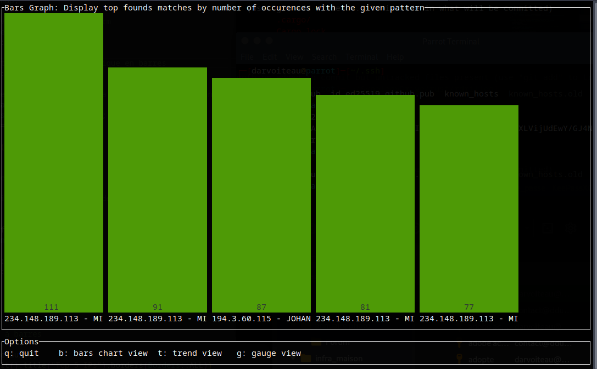

# Rdrillog

A lite and fast tool developed in Rust to analyze and sort log file by patterns.
Ideal to make security forensic investigations in log file
Ideal to search anything in a big log file
Ideal to make quickly external fabric connector web page for Fortinet Fortigate
<br>
<p align="center">
  
</p>
<br>

## Features
- Analyze and filter logs in output file by simple word, string, regex
- In found logs, you can exclude logs in the output file result by string or regex
- In found logs, you can include another logs in the output file result by string or regex
- Extract logs that only match by given word, string, regex, not the entire line of log
- Start a simple http webserver with the filtered logs output file (useful for external connector of Fortigate or other analyzing tools to scrape filtered output logs)
- BarChart, Trend and Gauge vizualisation

## Installation
```bash
git clone https://github.com/darvoiteau/rdrillog.git
cd rdrillog
cargo build --release
cd target/release
./rdrillog --help
```

****or****
Download the release here to get the binary executable: <a href="https://github.com/darvoiteau/rdrillog/releases">rdrillog releases</a>

chmod +x rdrillog-xxxxx
./rdrillog-xxxxx --help


## Usage

-f (--elem-to-find): The pattern to find things in the log file. It can be a word, string, regex. Please use "" around your regex.

-i (--include-regex): The pattern in addition of -f to find things in the log file. It can be a word, string, regex. Please use "" around your regex.

-e (--exclude-regex): The pattern to exclude logs found by -i or -f in the log file. It can be a word, string, regex. Please use "" around your regex.

-o (--output): The name of output file that will contain your filtered logs. It is a mandatory option. By default it is output.txt

-m (--match-only): Will take only things that match with this pattern in matched -f -i logs instead of the take the entire line of log, for regex use ""

-l (--logfile): Mandatory option. The logfile to analyze.

-s (--strict): If enabled, will extract only pattern given in -f -l in log file, not the entire line. Use "true" to enable it. The difference between -s and -m:  In the case of -s, the only extracted pattern is defined by -f and -i directly, in the case of -m, the only extracted pattern is defined by -m not by -f and -i.

-d (--duplicate): Ff this option is disabled, no duplicate entry will be saved in the output file, to disable it use "false" value.

-w (--webserver): Start a webserver to display logs filtered in the output file. Use "true" value

--ip: Set the ip listening for the webserver

--port: Set the port listening for the webserver

--parsing-time: When you run the webserver, rdrillog will parse in X seconds again given log file to find any news things. This parameter define the interval between each log parsing in second. By default 3600s -> 1h

-g (--graph): Enable Graph visualization with BarChart, Trend, and Gauge. The option is unavailable with the web-server


## Example usage

### Basic usage

Simple search IP:

```bash
rdrillog -f 255.110.196.243 -l big.log
```

In output.txt all logs that match with "255.110.196.243" IP:

```bash
255.110.196.243 - MICHEL_XXXX [01/Jan/2016:01:08:08 +0100] "GET http://XXXX.com/css/select2.css HTTP/1.1" 304 0
255.110.196.243 - MICHEL_XXXX [01/Jan/2016:01:08:08 +0100] "GET http://XXXX.com/css/main.css HTTP/1.1" 304 0
255.110.196.243 - MICHEL_XXXX [01/Jan/2016:01:08:08 +0100] "GET http://XXXX.com/javascript/jquery.js HTTP/1.1" 304 0
255.110.196.243 - MICHEL_XXXX [01/Jan/2016:01:08:08 +0100] "GET http://XXXX.com/javascript/placeholders.js HTTP/1.1" 304 0
```

If we want to search "255.110.196.243" and "204.195.156.4":

```bash
rdrillog -f 255.110.196.243 -i 204.195.156.4 -l big.log
```

In output.txt all logs that with match with our 2 IPs:

```bash
255.110.196.243 - MICHEL_XXXX [01/Jan/2016:01:08:08 +0100] "GET http://XXXX.com/css/select2.css HTTP/1.1" 304 0
255.110.196.243 - MICHEL_XXXX [01/Jan/2016:01:08:08 +0100] "GET http://XXXX.com/css/main.css HTTP/1.1" 304 0
255.110.196.243 - MICHEL_XXXX [01/Jan/2016:01:08:08 +0100] "GET http://XXXX.com/javascript/jquery.js HTTP/1.1" 304 0
255.110.196.243 - MICHEL_XXXX [01/Jan/2016:01:08:08 +0100] "GET http://XXXX.com/javascript/placeholders.js HTTP/1.1" 304 0
204.195.156.4 - JOHANNA.XXXX [01/Jan/2016:00:35:48 +0100] "GET http://www.XXXX.com/topic/journal/067092541 HTTP/1.1" 200 65127
204.195.156.4 - JOHANNA.XXXX [01/Jan/2016:00:35:53 +0100] "GET http://XXXX.com/index.htm HTTP/1.1" 200 65127
204.195.156.4 - JOHANNA.XXXX [01/Jan/2016:00:35:53 +0100] "GET http://cdn.XXX.com/css/main.css HTTP/1.1" 200 26603
```

If you want to exclude something in the result, for example logs that contain "placeholders" as you can see in the last log of MIchel in the previous output.txt:

```bash
rdrillog -f 255.110.196.243 -i 204.195.156.4 -e placeholders -l big.log
```

In output.txt :

```bash
255.110.196.243 - MICHEL_XXXX [01/Jan/2016:01:08:08 +0100] "GET http://XXXX.com/css/select2.css HTTP/1.1" 304 0
255.110.196.243 - MICHEL_XXXX [01/Jan/2016:01:08:08 +0100] "GET http://XXXX.com/css/main.css HTTP/1.1" 304 0
255.110.196.243 - MICHEL_XXXX [01/Jan/2016:01:08:08 +0100] "GET http://XXXX.com/javascript/jquery.js HTTP/1.1" 304 0
204.195.156.4 - JOHANNA.XXXX [01/Jan/2016:00:35:48 +0100] "GET http://www.XXXX.com/topic/journal/067092541 HTTP/1.1" 200 65127
204.195.156.4 - JOHANNA.XXXX [01/Jan/2016:00:35:53 +0100] "GET http://XXXX.com/index.htm HTTP/1.1" 200 65127
204.195.156.4 - JOHANNA.XXXX [01/Jan/2016:00:35:53 +0100] "GET http://cdn.XXX.com/css/main.css HTTP/1.1" 200 26603
```
The log line of Michel with "placeholders" was removed.

Extract all IPs of line logs with -s option:

```bash
rdrillog -f "[0-9]{1,3}[.]{1}[0-9]{1,3}[.]{1}[0-9]{1,3}[.]{1}[0-9]{1,3}" -s true -l big.log
```

The output.txt:

```bash
30.209.245.247
11.171.106.249
254.185.62.159
254.185.62.159
254.185.62.159
254.185.62.159
254.185.62.159
254.185.62.159
57.76.44.39
57.76.44.39
57.76.44.39
57.76.44.39
57.76.44.39
57.76.44.39
57.76.44.39
57.76.44.39
226.23.234.168
57.76.44.39
188.195.199.192
57.76.44.39
188.195.199.192
188.195.199.192
188.195.199.192
...
```
The -s option extract only the matched pattern given in -f not the entire line of log.

We have some ip duplication in the previous output.txt, to avoid this use -d false:

```bash
rdrillog -f "[0-9]{1,3}[.]{1}[0-9]{1,3}[.]{1}[0-9]{1,3}[.]{1}[0-9]{1,3}" -s true -d false -l big.log
```

and the result:

```bash
254.185.62.159
226.23.234.168
188.195.199.192
187.130.103.162
132.161.237.250
27.191.35.140
82.50.153.49
43.53.164.49
94.155.7.232
78.17.16.188
40.183.67.135
33.23.123.154
229.10.20.3
55.113.158.120
126.220.18.136
18.136.138.50
198.155.219.234
165.108.198.91
247.108.88.98
56.145.236.115
45.65.33.178
10.1.20.23
254.185.62.159
226.23.234.168
188.195.199.192
187.130.103.162
132.161.237.250
27.191.35.140
82.50.153.49
43.53.164.49
94.155.7.232
78.17.16.188
40.183.67.135
33.23.123.154
229.10.20.3
55.113.158.120
126.220.18.136
18.136.138.50
198.155.219.234
165.108.198.91
247.108.88.98
56.145.236.115
45.65.33.178
10.1.20.23
15.4.0.145
112.106.73.168
177.105.38.17015.4.0.145
112.106.73.168
177.105.38.170
...
```

You can use -e -f -i in the same time with regex.

## Graph usage

Just use "-g true" to enable this option.
When this option is enabled, you will see metrics about given pattern with BarChart, Trend, Gauge 

```bash
rdrillog -l big.log -f "[0-9]{1,3}[.]{1}[0-9]{1,3}[.]{1}[0-9]{1,3}[.]{1}[0-9]{1,3}" -g true
```
<br>
<p align="center">
  
</p>
<br>
To switch between Gauge and Trend chart use 't' or 'g'. To quit rdrillog, press 'q'.


## Advanced and Webserver usage

To filter IP in logs without duplication and run webserver with the result:

```bash
rdrillog -f "[0-9]{1,3}[.]{1}[0-9]{1,3}[.]{1}[0-9]{1,3}[.]{1}[0-9]{1,3}" -s true -d false -l big.log -w true --ip 192.168.20.2 --port 3500 --parsing-time 60
Web server is running: http://192.168.20.2:3500/output.txt
```
Each 60s, rdrillog will parse again filelog to find any news things.

And if we curl the given url "http://192.168.20.2:3500/output.txt":

```bash
curl -v http://192.168.20.2:3500/output.txt
*   Trying 192.168.20.2:3500...
* Connected to 192.168.20.2 (192.168.20.2) port 3500
* using HTTP/1.x
> GET /output.txt HTTP/1.1
> Host: 192.168.20.2:3500
> User-Agent: curl/8.12.1
> Accept: */*
> 
* Request completely sent off
< HTTP/1.1 200 OK
< content-type: text/plain
< content-length: 34839
< date: Sat, 19 Apr 2025 17:33:17 GMT
< 
199.60.47.128
247.3.213.181
204.195.156.4
255.110.196.243
16.37.187.240
55.214.173.145
1.79.39.45
205.60.230.72
181.24.241.114
156.186.75.197
122.223.113.108
9.75.147.167
...
```

Below the example that I use to add malicious IP with the "External connector" feature of my Fortigate. It can be usefull for other security/analyzing tools/devices:

```bash
rdrillog -f "srcip=[0-9]{1,3}[.]{1}[0-9]{1,3}[.]{1}[0-9]{1,3}[.]{1}[0-9]{1,3}" -l fortigate_cef.log -e "srcip=(10\.0\.0\.[1-2]|192.168.[0-9]{1,3}.[0-9]{1,3}|255.255.255.255)" -m "[0-9]{1,3}[.]{1}[0-9]{1,3}[.]{1}[0-9]{1,3}[.]{1}[0-9]{1,3}" -d false -o ip_honeypot.txt
```
What do this command ? :
- I filter all ip in "srcip" of my fortigate log file
- With -e I exclude private IP of my network to keep only public IP. If I keep only public ip in src (so incoming to my network) it mean that are malicious IP which attempt to attack my honeypot.
- I take only IP that match with -f and not match with -e with -m. -m contain a regex that match IPs.
- I run a webserver to show in the web ip_honeypot.txt. This txt file contain malicious IP

And now I can use it on my Fortigate:

```bash
config system external-resource
    edit "bad_ip_honeypot"
        set uuid 91326b7e-1b9a-51f0-1591-15babdb665e5
        set type address
        set resource "http://192.168.20.2:3500/ip_honeypot.txt"
        set refresh-rate 730
    next
end
```
